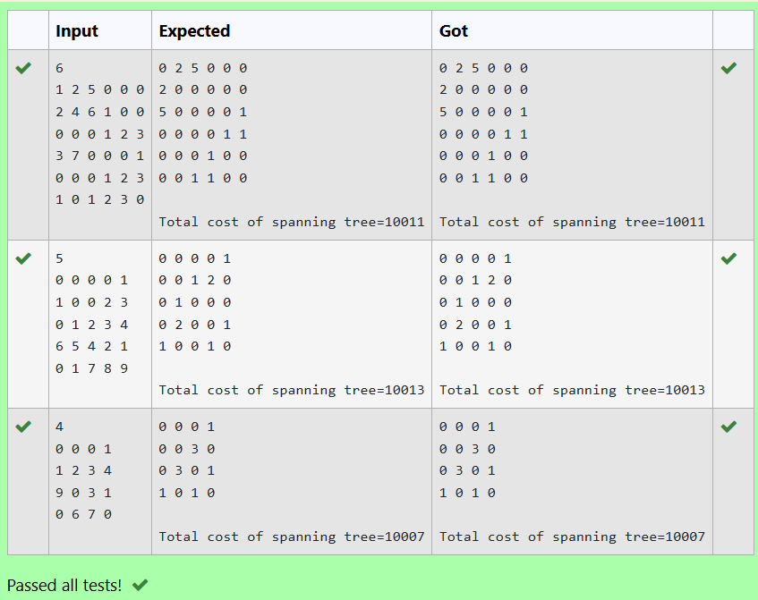

# Ex26 Prim’s Algorithm
## DATE: 15-05-2025
## AIM:
To write a C program to implement Prim's Algorithm for finding Total Cost of tree.

## Algorithm
1. Start the program.
2. Read the number of vertices n and the adjacency matrix G.
3. Initialize the cost, spanning, distance, from, and visited arrays.
4. Apply Prim’s algorithm to build the minimum spanning tree by selecting the vertex with the minimum distance, updating the spanning tree, and updating the distance array.
5. Repeat the process until all edges are added to the spanning tree.
6. Print the spanning matrix and the total cost of the spanning tree.  

## Program:
```c
/*
Program to implement Prim's Algorithm
Developed by: Roopak C S 
Register Number: 212223220088 
*/

#include <stdio.h>
#include <stdlib.h>

#define infinity 9999
#define MAX 20

int G[MAX][MAX], spanning[MAX][MAX], n;

int prims();

int main()
{
  int i, j, total_cost;
  scanf("%d", &n);
  for (i = 0; i < n; i++)
    for (j = 0; j < n; j++)
      scanf("%d", &G[i][j]);
  total_cost = prims();

  for (i = 0; i < n; i++)
  {
    for (j = 0; j < n; j++)
      printf("%d ", spanning[i][j]);
    printf("\n");
  }
  printf("\nTotal cost of spanning tree=%d", total_cost);
  return 0;
}

int prims()
{
  int cost[MAX][MAX];
  int u, v, min_distance, distance[MAX], from[MAX];
  int visited[MAX], no_of_edges, i, min_cost, j;
  // create cost[][] matrix,spanning[][]
  for (i = 0; i < n; i++)
    for (j = 0; j < n; j++)
    {
      if (G[i][j] == 0)
        cost[i][j] = infinity;
      else
        cost[i][j] = G[i][j];
      spanning[i][j] = 0;
    }
  // initialise visited[],distance[] and from[]
  distance[0] = 0;
  visited[0] = 1;

  // find the vertex at minimum distance from the tree
  //  Text your code here
  for (int i = 1; i < n; i++)
  {
    distance[i] = cost[0][i];
    from[i] = 0;
    visited[i] = 0;
  }

  min_cost = 0;
  no_of_edges = n - 1;

  while (no_of_edges > 0)
  {
    min_distance = infinity;
    for (int i = 1; i < n; i++)
    {
      if (visited[i] == 0 && distance[i] < min_distance)
      {
        v = i;
        min_distance = distance[i];
      }
    }
    u = from[v];

    // insert the edge in spanning tree
    spanning[u][v] = distance[v];
    spanning[v][u] = distance[v];
    no_of_edges--;
    visited[v] = 1;
    // updated the distance[] array
    for (i = 1; i < n; i++)
      if (visited[i] == 0 && cost[i][v] < distance[i])
      {
        distance[i] = cost[i][v];
        from[i] = v;
      }
    min_cost = min_cost + cost[u][v];
  }
  return (min_cost);
}
```

## Output:



## Result:
Thus, the C program to implement Prim's Algorithm for finding Total Cost of tree is implemented successfully.
