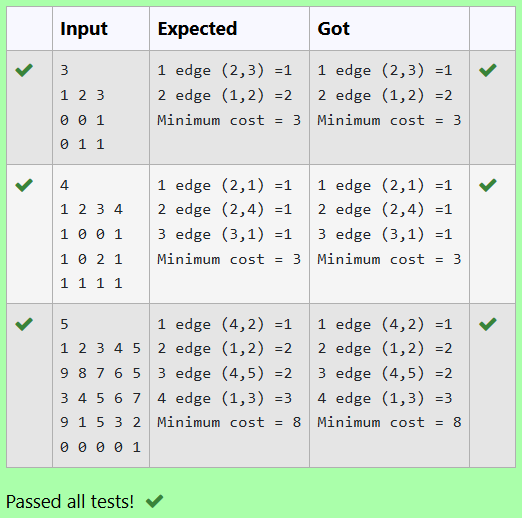

# Ex27 Kruskal’s Algorithm
## DATE: 16-05-2025
## AIM:
To write a C program to implement Kruskal's Algorithm for finding minimum cost

## Algorithm
1. Start the program.
2. Read the number of vertices n and the adjacency matrix G.
3. Initialize the edge list elist and extract all edges from the matrix into elist.
4. Sort the edges in increasing order of weight.
5. Initialize a belongs array where each vertex is initially in its own set.
6. Process each edge, checking if the vertices belong to different sets using find. If they do, add the edge to the spanlist and unite the sets using union1.
7. Print the edges of the minimum spanning tree along with its total cost.
8. End the program. 

## Program:
```c
/*
Program to implement Kruskal's Algorithm
Developed by: Roopak C S
Register Number: 212223220088 
*/

#include <stdio.h>
#include <stdlib.h>
int i, j, k, a, b, u, v, n, ne = 1;
int min, mincost = 0, cost[9][9], parent[9];
int find(int);
int uni(int, int);
int main()
{
  scanf("%d", &n);
  for (i = 1; i <= n; i++)
  {
    for (j = 1; j <= n; j++)
    {
      scanf("%d", &cost[i][j]);
      if (cost[i][j] == 0)
        cost[i][j] = 999;
    }
  }

  while (ne < n)
  {
    for (i = 1, min = 999; i <= n; i++)
    {
      for (j = 1; j <= n; j++)
      {
        if (cost[i][j] < min)
        {
          min = cost[i][j];
          a = u = i;
          b = v = j;
        }
      }
    }

    u = find(u);
    v = find(v);

    if (uni(u, v))
    {
      printf("%d edge (%d,%d) =%d\n", ne++, a, b, min);
      mincost += min;
    }

    cost[a][b] = cost[b][a] = 999;
  }
  printf("Minimum cost = %d\n", mincost);
  return 0;
}

// Text your code here for find() and uni()
int find(int i)
{
  while (parent[i])
  {
    i = parent[i];
  }
  return i;
}

int uni(int i, int j)
{
  if (i != j)
  {
    parent[j] = i;
    return 1;
  }
  return 0;
}
```

## Output:


## Result:
Thus, the C program to implement Kruskal's Algorithm for finding minimum cost is implemented successfully.
