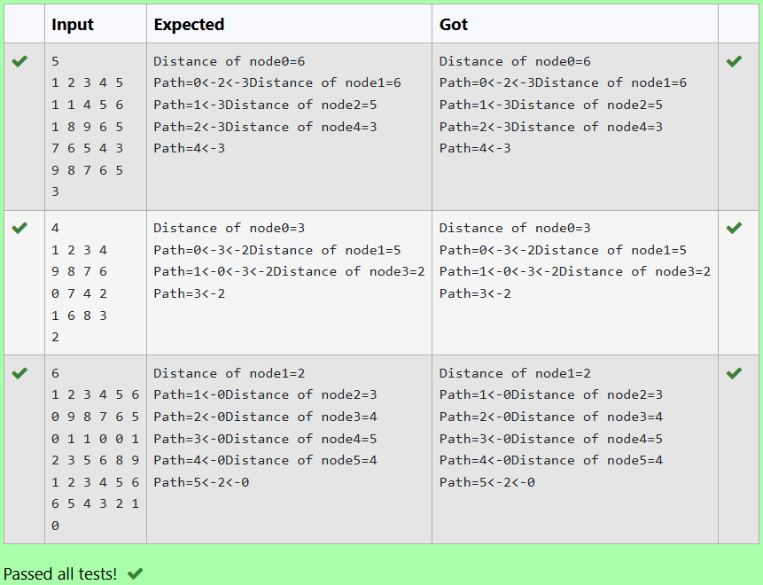

# Ex28 Dijkstra’s Algorithm
## DATE: 16-05-2025
## AIM:
To write a C Program to implement Dijkstra's Algorithm to find the shortest path

## Algorithm
1. Start the program.
2. Read the number of vertices n and the adjacency matrix G representing the graph.
3. Read the starting node u for Dijkstra's algorithm.
4. Create the cost matrix where each G[i][j] is copied, and replace 0 values with infinity (except for the diagonal).
5. Initialize the distance, pred, and visited arrays.
6. For each node, find the one with the minimum distance that hasn't been visited. Update the distances and predecessors of its unvisited neighbors.
7. Repeat the process until all nodes are visited.
8. After the algorithm completes, print the shortest distance from the start node to each node and the path taken to reach each node.
9. End the program. 

## Program:
```c
/*
Program to implement Dijkstra's Algorithm 
Developed by: Roopak C S 
Register Number: 212223220088 
*/

#include <stdio.h>
#include <stdlib.h>
int i, j, k, a, b, u, v, n, ne = 1;
int min, mincost = 0, #include<stdio.h>
#define INFINITY 9999
#define MAX 10

    void dijkstra(int G[MAX][MAX], int n, int startnode);

int main()
{
  int G[MAX][MAX], i, j, n, u;
  scanf("%d", &n);
  for (i = 0; i < n; i++)
    for (j = 0; j < n; j++)
      scanf("%d", &G[i][j]);
  scanf("%d", &u);
  dijkstra(G, n, u);
  return 0;
}

void dijkstra(int G[MAX][MAX], int n, int startnode)
{
  int cost[MAX][MAX], distance[MAX], pred[MAX];
  int visited[MAX], count, mindistance, nextnode, i, j;
  // pred[] stores the predecessor of each node
  // count gives the number of nodes seen so far
  // create the cost matrix
  for (i = 0; i < n; i++)
    for (j = 0; j < n; j++)
      if (G[i][j] == 0)
        cost[i][j] = INFINITY;
      else
        cost[i][j] = G[i][j];
  // initialize pred[],distance[] and visited[]
  for (i = 0; i < n; i++)
  {
    distance[i] = cost[startnode][i];
    pred[i] = startnode;
    visited[i] = 0;
  }
  distance[startnode] = 0;
  visited[startnode] = 1;
  count = 1;
  while (count < n - 1)
  {
    mindistance = INFINITY;
    // nextnode gives the node at minimum distance
    for (i = 0; i < n; i++)
      if (distance[i] < mindistance && !visited[i])
      {
        mindistance = distance[i];
        nextnode = i;
      }
    // check if a better path exists through nextnode

    // Text your code here
    visited[nextnode] = 1;
    for (i = 0; i < n; i++)
    {
      if (!visited[i])
      {
        if (mindistance + cost[nextnode][i] < distance[i])
        {
          distance[i] = mindistance + cost[nextnode][i];
          pred[i] = nextnode;
        }
      }
    }
    count++;
  }

  // print the path and distance of each node
  for (i = 0; i < n; i++)
    if (i != startnode)
    {
      printf("Distance of node%d=%d\n", i, distance[i]);
      printf("Path=%d", i);
      j = i;
      do
      {
        j = pred[j];
        printf("<-%d", j);
      } while (j != startnode);
    }
}
cost[9][9], parent[9];
int find(int);
int uni(int, int);
int main()
{
  scanf("%d", &n);
  for (i = 1; i <= n; i++)
  {
    for (j = 1; j <= n; j++)
    {
      scanf("%d", &cost[i][j]);
      if (cost[i][j] == 0)
        cost[i][j] = 999;
    }
  }

  while (ne < n)
  {
    for (i = 1, min = 999; i <= n; i++)
    {
      for (j = 1; j <= n; j++)
      {
        if (cost[i][j] < min)
        {
          min = cost[i][j];
          a = u = i;
          b = v = j;
        }
      }
    }

    u = find(u);
    v = find(v);

    if (uni(u, v))
    {
      printf("%d edge (%d,%d) =%d\n", ne++, a, b, min);
      mincost += min;
    }

    cost[a][b] = cost[b][a] = 999;
  }
  printf("Minimum cost = %d\n", mincost);
  return 0;
}

// Text your code here for find() and uni()
int find(int i)
{
  while (parent[i])
  {
    i = parent[i];
  }
  return i;
}

int uni(int i, int j)
{
  if (i != j)
  {
    parent[j] = i;
    return 1;
  }
  return 0;
}
```

## Output:



## Result:
Thus, the Program to implement Dijkstra's Algorithm to find the shortest path is implemented successfully.
