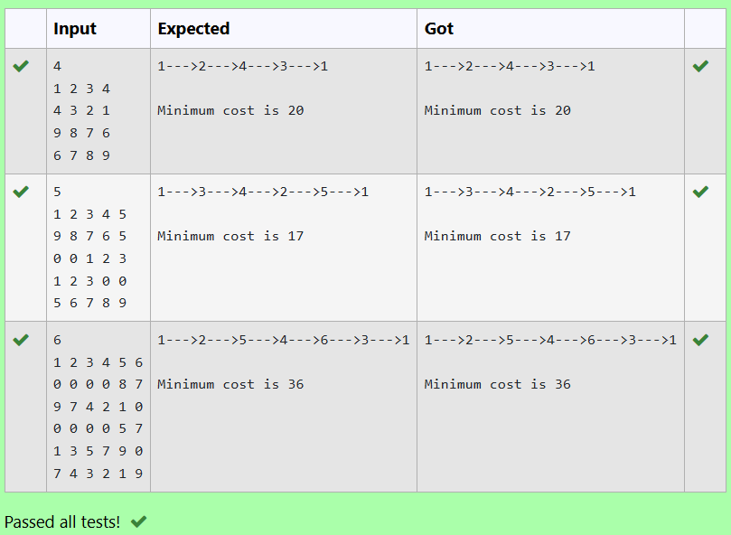

# Ex29 Travelling Salesman Problem
## DATE: 19-06-2025
## AIM:
To write a C Program to implement Travelling Salesman Problem for finding shortest path.
## Algorithm
1. Start the program.
2. Read the number of cities n and the adjacency matrix a representing the distances between cities.
3. Initialize a visited array to track which cities have been visited.
4. Start the process with city 0 and print its number.
5. In the mincost function, find the nearest unvisited city using the least function.
6. If all cities are visited, return to the starting city (city 0) and finish.
7. In the least function, find the unvisited city with the smallest cost from the current city, and update the cost.
8. Print the minimum cost of the route after visiting all cities.
9. End the program. 

## Program:
```c
/*
Program to implement Travelling Salesman Problem for finding shortest path
Developed by: Roopak C S 
Register Number: 212223220088 
*/

#include <stdio.h>
int ary[10][10], completed[10], n, cost = 0;
void takeInput()
{
  int i, j;
  scanf("%d", &n);
  for (i = 0; i < n; i++)
  {
    for (j = 0; j < n; j++)
      scanf("%d", &ary[i][j]);
    completed[i] = 0;
  }
}
int least(int c)
{
  int i, nc = 999;
  int min = 999, kmin;
  for (i = 0; i < n; i++)
  {
    if ((ary[c][i] != 0) && (completed[i] == 0))
      if (ary[c][i] + ary[i][c] < min)
      {
        min = ary[i][0] + ary[c][i];
        kmin = ary[c][i];
        nc = i;
      }
  }
  if (min != 999)
    cost += kmin;
  return nc;
}
void mincost(int city)
{
  int ncity;
  completed[city] = 1;
  printf("%d--->", city + 1);
  ncity = least(city);
  if (ncity == 999)
  {
    ncity = 0;
    printf("%d", ncity + 1);
    cost += ary[city][ncity];
    return;
  }
  mincost(ncity);
}
int main()
{
  takeInput();
  mincost(0); // passing 0 because starting vertex
  printf("\n\nMinimum cost is %d\n ", cost);
  return 0;
}
```

## Output:



## Result:
Thus, the C program to implement Travelling Salesman Problem for finding shortest path is implemented successfully.
